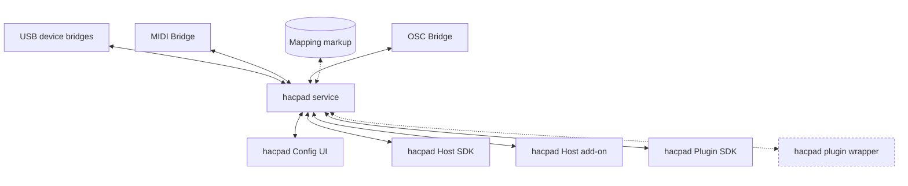

# hacpad Design: Host-Agnostic Semantic Control

## Priority
The star of the show is getting bespoke, reverse-engineered vendor hardware (Nektar Panorama, AKAI Advance, etc. — see `research/DAW-feasibility-checklist.md`) talking directly to whatever plugin is loaded, including drawing to the hardware's own screen/LEDs.

Two separate axes matter for everything else, and they're inverted from each other:

1. **What we can actually build, near-term.** hacpad Host add-on and the hacpad plugin wrapper are both things *we* build ourselves — the add-on using whatever scripting/extension/OSC surface a DAW already exposes (no DAW vendor cooperation needed beyond what's already public), the wrapper by hosting the target plugin ourselves. Both are reachable now. hacpad Host SDK depends on a DAW vendor building and exposing a native SDK to us — possible, but not likely to be picked up. hacpad Plugin SDK depends on plugin vendors adopting it directly — very unlikely to ever reach critical mass.
2. **What wins at runtime if several happen to be available for the same DAW/plugin.** There, Host SDK is preferred first when present, since it's the most authoritative and complete — see [Runtime priority](#runtime-priority) below. It's the least likely to exist, but the best option if it does.

This shapes the whole design: the near-term core loop below needs no plugin-vendor cooperation and no DAW-vendor cooperation beyond a DAW's already-public extension surface.

## Core loop (v1)
```
hacpad USB Bridge (reverse-engineered device driver)
        ↕
   hacpad service (thin routing)
        ↕
   hacpad plugin wrapper                 hacpad Host add-on
   (hosts the target plugin;             (built against whatever the DAW
   reads its own parameter list           already exposes — a scripting
   via VST3/CLAP introspection)           API, extension, or OSC surface)
```

- Both paths are things **we** build — no plugin-vendor or DAW-vendor cooperation required beyond what's already publicly exposed.
- The wrapper needs zero cooperation from the plugin author — it hosts the target plugin and reads its already-standard parameter metadata (name, range, current value), the same way any VST3/CLAP host can.
- A working default needs **no authored mapping markup at all**: e.g. "encoder 1–8 → the plugin's first 8 automatable parameters" is a reasonable zero-config default. Mapping markup (below) is the enhancement layer on top — relabeling, enums, conditional slots — not a prerequisite for a first working demo.
- Screen/LED drawing is a first-class capability of the USB Bridge, not an afterthought — it's specifically why reverse-engineering the bespoke protocol matters, since generic MIDI feedback can't drive arbitrary LCD/OLED graphics.
- Host SDK and Plugin SDK (below) are later enhancements — not required for the core loop, and not something we control the timeline of.

## Architecture diagram



Reading the diagram: each transport (USB, MIDI, OSC) reaches the **hacpad service** through its own transport-specific bridge — there is no single shared bridge component, just one per transport (and USB itself is really device-specific: a distinct bridge per controller, not one generic USB bridge). The service talks directly to whichever **client** is present — Host SDK, Host add-on, hacpad Plugin SDK, or the hacpad plugin wrapper — over the same control contract: `describe / subscribe / beginGesture / adjust / set / invoke / endGesture`.

The wrapper is dashed because it's capability-limited (tier-1 scalar params only, no deep plugin state) — not because it's low-priority; per [Core loop](#core-loop-v1), it's one of the two things we actually build first. Host SDK and Plugin SDK are the ones outside our control — see [Priority](#priority).

Each client declares its own capabilities, at the **host level** (automation, transport, mixer, track/session state) and/or the **plugin level** (deep gestures, non-parameter UI state, custom actions) — and that capability set is specific to the client type *and* the DAW it's running in. The actual capability matrix (client × DAW × host-level/plugin-level) is future work, not started.

## Client model
Ordered by what we actually control:

- **hacpad service**: the OS-level sidecar process. Owns mapping evaluation, routing, and runtime state — it's the only thing that talks to more than one other component. A native Plugin SDK plugin, or a Host add-on in a permissive-enough DAW scripting environment (e.g. Reaper), *could* technically bypass it and talk straight to a USB bridge — but that gives up what the service exists for: exclusive-device arbitration across multiple simultaneous consumers, sandboxing compliance, crash isolation from a far-less-stable plugin/script process, and not re-deriving the reverse-engineered USB protocol per client instead of once.
- **Transport bridges**: one per transport (USB, MIDI, OSC — see diagram), each owning the actual driver work for that transport. USB bridges are device-specific, not generic.
  - **OSC specifically**: publish our own OSC address grammar (a documented namespace, e.g. `/hacpad/<target>/...`) instead of only reacting to whatever address scheme a given app happens to use. The `<target>` isn't a new vocabulary to invent — it's the same parameter/action naming mapping markup already uses (`filter.cutoff`, `browser.next_preset`, etc.), just exposed as OSC paths. Anyone targeting that grammar directly — a generic app (TouchOSC, Lemur, Open Stage Control) configured by hand, or a bespoke client — gets the zero-config default with no per-layout mapping translation needed. Same pattern Reaper's own OSC implementation already uses in practice (publish `.ReaperOSC`, let TouchOSC/Lemur users configure against it). Mapping markup still exists for customizing the binding, just isn't required for the default case.
- **hacpad plugin wrapper**: hosts the target plugin and exposes its standard (VST3/CLAP-introspectable) parameters. We build it; no plugin-vendor cooperation needed. Core loop client — see [Core loop](#core-loop-v1).
- **hacpad Host add-on**: built against whatever a DAW already exposes — a scripting API, an installable extension, or an existing OSC command surface (e.g. Reaper's built-in OSC, or AbletonOSC for Live). We build it; no DAW-vendor cooperation needed beyond what's already public. Core loop client, one per target DAW.
- **hacpad Host SDK**: a native SDK a DAW vendor would need to build and expose to us. Preferred at runtime when present (see [Runtime priority](#runtime-priority)) — but not something we control the timeline of, and not likely to be picked up.
- **hacpad Plugin SDK**: an SDK plugin authors adopt directly, for deeper (tier-2) state a wrapper can't reach. Requires plugin-vendor adoption directly — very unlikely to reach critical mass.
- **hacpad Config UI**: hacpad supplies mapping markup by some means, but it has to be user-editable, not fixed — this is where. Beyond that:
  - Each bridge contributes its own configuration surface here instead of the UI hardcoding one generic form (a USB bridge's device selection/calibration looks nothing like an OSC bridge's listen port/address prefix).
  - Editing works at the plugin-instance level, not just per plugin type — two loaded instances of the same plugin can want different physical mappings.
  - Separately, a bridge-instance-level tweak: the canonical mapping refers to controls abstractly (e.g. "bank A, knob 8") — binding that to the actual physical control on *this specific connected device* is its own layer, distinct from the plugin-instance mapping above.
  - Open question, not resolved here: the precedence hierarchy across mapping sources (built-in, user edits, runtime-generated fallback, etc.) when more than one applies.
  - Not every config surface lives here either: a bridge with its own screen (Nektar Panorama, AKAI Advance) can render its own config menu directly on the device, navigated by its own buttons, instead of or alongside the Config UI.
- **Mapping markup**: the portable schema describing pages, slots, labels, conditions, gestures, and feedback. Optional for a working default (see Core loop); required for anything beyond the zero-config case.

## Semantic mapping layer
hacpad's mapping contract has two tiers:

1. **Scalar parameter mappings and presentation rules**
   - Host- and plugin-capable, because it only needs observable parameter state.
   - Covers parameter mappings, read-only/read-write exposure, display labels, conditional slot selection, enum labels, visibility rules.
   - The portable foundation for controller surfaces; works without deep plugin integration — this is the tier the plugin wrapper reaches.

2. **Deep plugin-state semantics**
   - Plugin-only, requires the hacpad Plugin SDK.
   - Exposes richer state, custom actions, semantic gestures, browser state, non-parameter UI state, plugin-specific navigation.
   - Only the plugin can supply this because it alone observes its own internal state.

Integration can be implemented in any host-supported environment (JavaScript, Max for Live, or other host-specific extension systems). A host may also offer an optional native SDK for a deeper integration path — that's a separate host-author SDK, not required for the portable mapping contract.

### Declarative surface description
A `describeControllerSurface()` contract describes how a plugin or mapping wants to appear on controllers — pages, slots, labels, conditions, enums, gestures, meters, preferred controls, formatting hints, dynamic slot selection rules:
```text
plugin.describeControllerSurface();
```

### Live endpoint
```text
plugin.controllerEndpoint();
```
- controller → plugin: `beginGesture(param)`, `adjust(param, delta)`, `set(param, value)`, `invoke(action)` (`selectMode`/`browsePreset` are just `invoke()` calls with a specific action name, not separate primitives), `endGesture(param)`
- plugin → controller: `valueChanged(param)`, `textChanged(param)`, `pageInvalidated(page)`, `meterChanged(id)`, `modeChanged(id)`, `mappingChanged()`

This is the contract on the service-to-client side. The same kind of question exists on the bridge-to-service side and isn't resolved: whether USB, MIDI, and OSC bridges each translate their raw input straight into service-internal calls, or whether they should all normalize into one shared internal message format first. That's an implementation-burden question, separate from mapping markup (which only fixes naming, not the wire format) — still open.

## Mapping markup
The mapping file is the portable semantic contract; every client consumes the same schema. A DAW layer may publish a standard vocabulary for common concepts while still supporting free-form, host-specific extensions.

Supported sources:
- built into plugin
- installed sidecar file
- DAW-provided map
- community map
- user map
- runtime-generated fallback (includes the zero-config default described in [Core loop](#core-loop-v1))

A mapping covers: pages, slots, conditions, labels/value formatters, enum-dependent remapping, gestures, actions, display hints.

Binding routes declare the control path:
```yaml
slots:
  - parameter: filter.cutoff
    route: host      # via Host SDK/add-on
    direct_feedback: true
  - action: browser.next_preset
    route: plugin    # via Plugin SDK or wrapper
  - action: mod.assign_source
    route: plugin
    affects_project_state: true
```

Example mapping fragment:
```yaml
plugin:
  match:
    vendor: "Example Audio"
    name: "SemiModular"
parameters:
  osc_mode:
    match: "Osc Mode"
    enum:
      0: Classic
      1: Wavetable
      2: FM
pages:
  - name: Oscillator
    slots:
      - index: 0
        parameter: osc_mode
        label: Mode
      - index: 1
        select:
          - when: param("osc_mode") == "Classic"
            parameter: osc_shape
            label: Shape
          - when: param("osc_mode") == "Wavetable"
            parameter: wt_position
            label: WT Pos
          - when: param("osc_mode") == "FM"
            parameter: fm_ratio
            label: Ratio
      - index: 2
        select:
          - when: param("osc_mode") == "Classic"
            parameter: pwm
            label: PWM
          - when: param("osc_mode") == "Wavetable"
            parameter: wt_warp
            label: Warp
          - when: param("osc_mode") == "FM"
            parameter: fm_amount
            label: FM Amt
```

## DAW-level integration
The capability list below applies to whichever host-side client is actually present — Host add-on (core loop, built now) or Host SDK (later, if a DAW vendor ever provides one). It should support: canonical parameter writes and automation commits, host-level parameter control (track/send levels, mixer controls), transport control and sync state, track/scene/bank navigation, DAW action invocation (save, undo, arming), preset browsing if supported, selected track/device observation, and reactive updates for the above.

Multi-DAW-instance conflict resolution, and host-vs-plugin authority resolved via versioning/capability metadata, are real concerns here too — but only once the core loop is working.

## Runtime priority
Half-baked, not settled — a first guess at route preferences when more than one client could handle the same target, not a decided protocol rule. This is about which one wins at runtime, not which one we build first (see [Priority](#priority)):
- Automatable parameter write: Host SDK preferred over Host add-on, over plugin client.
- Plugin-private action: plugin client (wrapper or Plugin SDK) preferred.
- Page/label/value formatting: plugin or user map preferred.
- Track/device/session navigation: Host SDK or Host add-on preferred, whichever is present.
- Fallback: runtime generic mapping.

## Architecture summary
- Mapping schema = universal integration language.
- hacpad plugin wrapper + hacpad Host add-on = the core loop; both are ours to build, no external adoption required.
- hacpad Host SDK = preferred at runtime if a DAW vendor ever exposes one; not ours to build.
- hacpad Plugin SDK = later enhancement for plugin vendors who adopt it directly; unlikely to reach critical mass.
- hacpad service = merges, evaluates, routes, renders.

Do not encode plugin intelligence only in DAW scripts.
Do not encode controller intelligence only in plugin SDKs.
Put semantic intelligence in portable mapping files.
